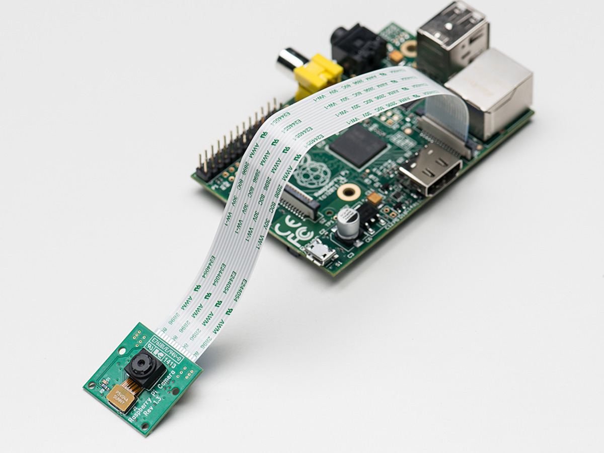
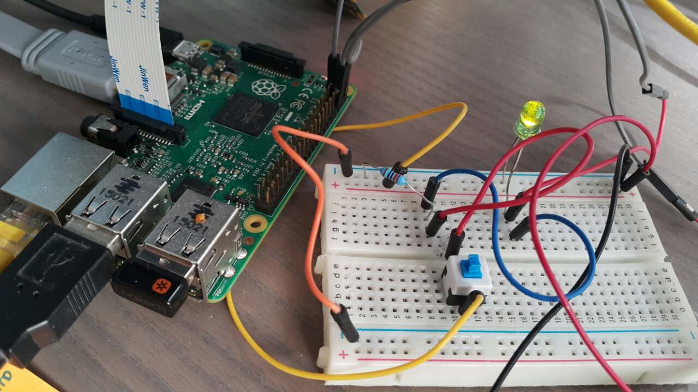

# Identify Motion Environment via RaspberyPi camera

The goal of this project is the creation of a device with image processing capabilities and real-time constraints. The final project contains a raspberry pi and a camera with dedicated function the identification of the motion in the environment and the start of recording with ultimate goal the actual stitching of video footage that contains only the important information. This project is vital for two main reasons. 1) The significant reduction in memory usage. 2) The actual efficiency for the user that needs to investigate the footage. - Originally developed 25/06/2017

## This project is vital for two main reasons
1. The significant reduction in memory usage
2. The actual efficiency for the user that needs to investigate the footage.

## Results of the Project 

## The setup should be able to perform the following tasks:
1. Read data from a camera (Raspberry Pi Camera Module V2 8MP,1080p) or a USB Web Camera (Logitech HD Pro Webcam C920).
2. Capable of executing Image processing functions and in general regular command lines from a computer or directly from Raspberry Pi.
3. The ability of saving separate image files and combining them to a final video.
4. The capability of working without a computer or a user in general.
